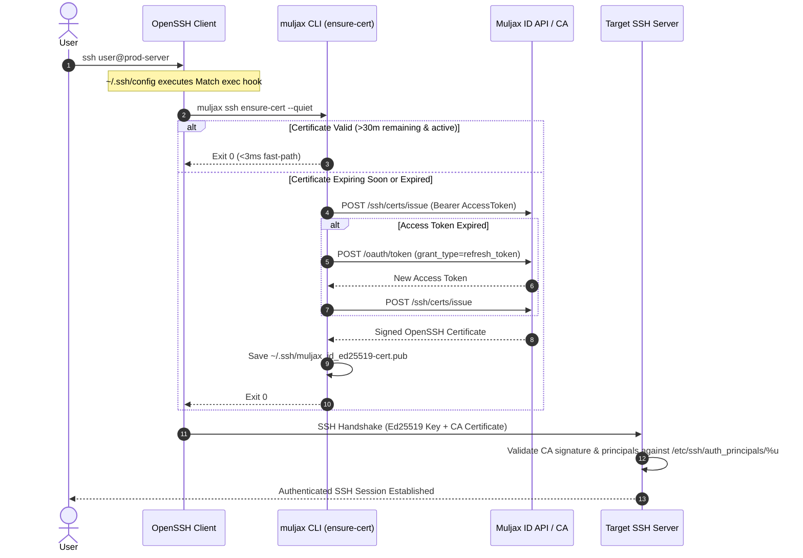

<div align="center">
	
</div>
<br />

---

# Muljax CLI (`muljax`)

The official command-line interface for the [Muljax Identity Platform](https://github.com/Muljax/id).

[](https://golang.org/)
[](https://www.openssh.com/)
[](https://oauth.net/2/)
[](https://www.kernel.org/)
[](https://apple.com/)
[](https://microsoft.com/)

</div>

---

> [!WARNING]
> Muljax CLI is pre-1.0 and, as such, may ship breaking releases without a major semver bump.

## Overview

The Muljax CLI (`muljax`) provides authentication, identity management, and automated zero-friction OpenSSH Certificate Authority (CA) client integration for the Muljax Identity Platform.

By natively hooking into OpenSSH client configuration via `Match host * exec`, `muljax` transparently validates and auto-renews short-lived SSH certificates before connection handshakes without interrupting workflows or requiring manual certificate requests.

## Features

- **Zero-Friction SSH**: Connect to any server trusting the Muljax CA using standard `ssh user@server` commands without manual intervention.
- **Automated OpenSSH Pre-Flight**: Integrates cleanly into `~/.ssh/config` using OpenSSH's native `Match host <pattern> exec "muljax ssh ensure-cert --quiet"`, scoped specifically to your organization's internal domains, subdomains, or IP ranges.
- **Transparent Certificate Renewal**: Expired or nearing-expiration (<30 minutes) certificates are automatically renewed in the background via OAuth 2.0 refresh tokens.
- **Local Key Security**: Asymmetric Ed25519 SSH private keys are generated locally and never transmitted over the network. Only the public key is signed by the CA.
- **Live CA Revocation Checks**: Verifies certificate serial numbers against the live CA Certificate Revocation List (KRL) with intelligent 5-minute local caching.
- **Secure Credential Storage**: OAuth 2.0 access and refresh tokens are stored in the OS Keyring (macOS Keychain, Linux Secret Service / DBus, Windows Credential Manager) with a secure permission-restricted filesystem fallback (`0600`).
- **Target Server Provisioning**: Generates ready-to-use OpenSSH daemon (`sshd_config`) and authorized principals configurations.

## How It Works



## Project Structure

```text
.
├── cmd/
│   ├── id/                 # Identity and authentication subcommands (muljax id auth)
│   │   └── id.go
│   ├── ssh/                # Modularized SSH CA management subcommands (muljax ssh)
│   │   ├── cert.go         # Key generation and manual certificate request
│   │   ├── ensure.go       # OpenSSH Match exec pre-flight auto-renewal hook
│   │   ├── server.go       # Target server setup guide and CA pubkey display
│   │   ├── setup.go        # Interactive onboarding wizard and OpenSSH config
│   │   ├── ssh.go          # SSH root command, config helpers, and cert inspector
│   │   ├── status.go       # Certificate status, validity, and revocation inspector
│   │   └── unhook.go       # Safe removal of OpenSSH configuration blocks
│   ├── install.go          # Self-installation command (muljax install)
│   └── root.go             # Root Cobra command and global persistent flags
├── pkg/
│   ├── auth/               # OAuth 2.0 PKCE flow, loopback server, and token refresh
│   │   ├── oauth.go
│   │   ├── pkce.go
│   │   └── pkce_test.go
│   ├── client/             # HTTP client for Muljax ID API and CA endpoints
│   │   ├── client.go
│   │   └── client_test.go
│   ├── config/             # CLI application configuration management
│   │   └── config.go
│   ├── sshutil/            # Key generation, certificate parsing, and ~/.ssh/config hooks
│   │   ├── cert.go
│   │   ├── config.go
│   │   ├── keys.go
│   │   └── sshutil_test.go
│   ├── storage/            # OS Keyring and secure fallback token storage
│   │   └── token.go
│   └── ui/                 # Terminal UI formatting, ANSI color, badges, and icons
│       └── ui.go
├── CONTRIBUTING.md          # Development and contribution guidelines
├── go.mod
├── go.sum
├── LICENSE                 # License file
├── main.go                 # Application entrypoint
├── README.md
├── SECURITY.md             # Vulnerability reporting and security policies
└── SETUP.md                # Comprehensive onboarding and setup guide
```

## Installation

### Requirements

- [Go](https://golang.org/) 1.24 or later
- [OpenSSH](https://www.openssh.com/) client (version 7.3+ for `Match exec` directive support)
- An active [Muljax Identity Platform](https://github.com/Muljax/id) instance

### Pre-built Binaries

Pre-compiled static binaries for Linux, macOS, and Windows (`amd64` and `arm64`) are automatically published to [GitHub Releases](https://github.com/Muljax/cli/releases).

1. Download the archive for your operating system and architecture.
2. Extract the archive and run the self-installer:
   ```bash
   ./muljax install
   ```

### Build and Install from Source

Clone the repository and compile the binary:

```bash
git clone https://github.com/Muljax/cli.git
cd cli
go build -o muljax .
```

Install the binary to your system:

```bash
./muljax install
```

*(Or specify custom options: `./muljax install --user` to install into `~/.local/bin`, or `./muljax install --dir /custom/bin`)*

Verify the installation:

```bash
muljax --help
muljax version
```

## Getting Started

### 1. Initial Setup

Run the automated setup wizard to configure your local keys, authenticate, obtain your initial certificate, and configure OpenSSH:

```bash
muljax ssh setup
```

When run interactively, the setup wizard will prompt for your deployment details:
1. **Target Endpoint**: Prompts for your Muljax ID API endpoint (e.g. `https://id.your-domain.com`), defaulting to `http://localhost:8787` or your existing configured endpoint.
2. **Host Scoping**: Prompts for your internal host pattern (e.g. `*.your-domain.com,*.internal`) to ensure OpenSSH only activates `muljax` for your organization's servers.

*(Tip: You can also pass flags directly for non-interactive or scripted setup: `muljax ssh setup --endpoint https://id.your-domain.com --hosts "*.your-domain.com,*.internal"`)*

The wizard will:
1. Generate an Ed25519 key pair at `~/.ssh/muljax_id_ed25519`.
2. Launch your browser for OAuth 2.0 PKCE authentication against the Muljax ID platform.
3. Securely store your OAuth credentials in your operating system's keyring.
4. Request a signed certificate from the Muljax CA and save it to `~/.ssh/muljax_id_ed25519-cert.pub`.
5. Prepend the scoped renewal hook to `~/.ssh/config`:
   ```sshconfig
   # BEGIN MULJAX SSH CONFIG
   Match host *.your-domain.com,*.internal exec "muljax ssh ensure-cert --quiet"
       IdentityFile ~/.ssh/muljax_id_ed25519
   # END MULJAX SSH CONFIG
   ```

> [!TIP]
> **Host Scoping**: Explicitly scoping the `Match host` pattern ensures `muljax` only activates for your organization's servers. It prevents intercepting unrelated SSH connections (such as `git push` to GitHub, personal VPSs, or home networks), avoiding redundant process execution and preventing your corporate certificate identity from being advertised to third-party hosts.

### 2. Connect to Servers

Connect to any server that trusts your Muljax CA using standard OpenSSH commands:

```bash
ssh user@server.internal
```

OpenSSH automatically executes `muljax ssh ensure-cert --quiet`.
- If your certificate is active and has more than 30 minutes of validity remaining, OpenSSH proceeds immediately (<3ms overhead).
- If your certificate is nearing expiration or expired, `muljax` transparently requests a new certificate in the background using your refresh token before OpenSSH completes the handshake.

---

## Command Reference

### Global Flags

All commands accept the following global flags:

| Flag | Type | Description | Default |
| --- | --- | --- | --- |
| `--config` | string | Path to custom configuration file | `$HOME/.config/muljax/config.json` |
| `--endpoint` | string | Target Muljax ID API endpoint URL | `http://localhost:8787` |
| `-v, --version` | boolean | Display CLI version information | |
| `-h, --help` | boolean | Display help information for any command | |

---

### `muljax install`

Installs the `muljax` executable into your system or user `PATH`:

```bash
# Auto-detects /usr/local/bin or ~/.local/bin
./muljax install

# Install for current user only (~/.local/bin)
./muljax install --user

# Install to custom directory
./muljax install --dir /opt/bin
```

---

### `muljax version`

Prints the current version, git commit, and build date:

```bash
muljax version
```

---

### `muljax id auth`

Manage user identity sessions and OAuth 2.0 tokens.

#### `muljax id auth login`

Authenticates with the Muljax Identity Platform via browser-based OAuth 2.0 PKCE:

```bash
muljax id auth login
```

#### `muljax id auth status`

Displays the current authentication session status, target endpoint, client ID, and token validity:

```bash
muljax id auth status
```

#### `muljax id auth logout`

Clears stored session tokens from the OS keyring and local storage:

```bash
muljax id auth logout
```

---

### `muljax ssh`

Manage SSH keys, certificates, automated renewal, and target server integration.

#### `muljax ssh setup`

Full onboarding wizard. Generates local key pair, logs in, issues initial certificate, and configures scoped `~/.ssh/config`:

```bash
muljax ssh setup [--endpoint <url>] [--hosts <pattern>]
```

Flags:
- `--endpoint string`: Target Muljax ID API endpoint URL (prompts interactively if omitted, defaulting to `$HOME/.config/muljax/config.json` or `http://localhost:8787`).
- `--hosts string`: Host pattern for OpenSSH `Match host` scoping (e.g. `'*.corp.example.com,*.internal'`). Prompts interactively if omitted.

#### `muljax ssh login`

Authenticates to Muljax ID and immediately issues a refreshed SSH certificate:

```bash
muljax ssh login
```

#### `muljax ssh cert`

Inspects the details of the active local SSH certificate (Key ID, Serial, Principals, Validity window, Extensions):

```bash
muljax ssh cert
```

Force immediate certificate renewal with a custom duration:

```bash
muljax ssh cert --renew --ttl 12
```

Flags:
- `-r, --renew`: Force immediate issuance and renewal of certificate from CA.
- `--ttl int`: Requested validity duration in hours (default: `8`).

#### `muljax ssh ensure-cert`

Pre-flight validity check and auto-renewal hook designed for OpenSSH `Match host * exec`:

```bash
muljax ssh ensure-cert --quiet
```

Flags:
- `-q, --quiet`: Suppress non-error output (essential for OpenSSH `Match exec` hook).
- `-f, --force-check`: Bypass local cache and force an immediate query to the live CA revocation list.

#### `muljax ssh status`

Displays comprehensive status of local SSH identity, public key, certificate paths, validity countdown, and live CA revocation status:

```bash
muljax ssh status
```

#### `muljax ssh server setup`

Fetches the CA public key from the Muljax ID API and outputs target server configuration instructions:

```bash
muljax ssh server setup
```

#### `muljax ssh unhook`

Safely removes the Muljax configuration block from `~/.ssh/config`:

```bash
muljax ssh unhook
```

---

## Target Server Configuration

To configure a target server to accept certificates issued by your Muljax CA:

1. Retrieve the CA public key using the CLI:
   ```bash
   muljax ssh server setup
   ```
2. Write the CA public key to `/etc/ssh/muljax_ca.pub` on the target host:
   ```bash
   echo "<ca-public-key>" | sudo tee /etc/ssh/muljax_ca.pub
   sudo chmod 644 /etc/ssh/muljax_ca.pub
   ```
3. Update `/etc/ssh/sshd_config` on the target host:
   ```sshconfig
   TrustedUserCAKeys /etc/ssh/muljax_ca.pub
   AuthorizedPrincipalsFile /etc/ssh/auth_principals/%u
   ```
4. Create authorized principals mapping for each local system account (e.g. `/etc/ssh/auth_principals/ubuntu`):
   ```bash
   sudo mkdir -p /etc/ssh/auth_principals
   echo -e "admin\nubuntu" | sudo tee /etc/ssh/auth_principals/ubuntu
   sudo chmod 644 /etc/ssh/auth_principals/ubuntu
   ```
5. Test the configuration and reload `sshd`:
   ```bash
   sudo sshd -t && sudo systemctl reload sshd
   ```

For advanced server configuration and policy setups, refer to the [Setup Guide](./SETUP.md).

---

## Configuration & Storage Layout

| File / Location | Description | Permissions |
| --- | --- | --- |
| `~/.config/muljax/config.json` | CLI configuration (endpoint, client ID, key name) | `0600` |
| `~/.config/muljax/tokens.json` | Token storage fallback if OS keyring unavailable | `0600` |
| `~/.ssh/muljax_id_ed25519` | Workstation Ed25519 private key | `0600` |
| `~/.ssh/muljax_id_ed25519.pub` | Workstation Ed25519 public key | `0644` |
| `~/.ssh/muljax_id_ed25519-cert.pub` | OpenSSH user certificate issued by Muljax CA | `0644` |
| `~/.ssh/muljax_id_ed25519-cert.pub.meta.json` | Cached certificate metadata, serial, and revocation state | `0644` |
| `~/.ssh/config` | User OpenSSH client configuration | `0600` |

---

## Security

Muljax CLI implements strict security practices:
- **Local Private Keys**: The Ed25519 private key is generated locally on your machine and never leaves your workstation.
- **PKCE Flow**: OAuth 2.0 authentication uses Proof Key for Code Exchange (PKCE) with SHA-256 challenges over loopback HTTP listeners (`127.0.0.1`).
- **Keyring Storage**: Session tokens are encrypted in OS-native secret stores via `go-keyring`.
- **Short-Lived Certificates**: Default certificate validity is 8 hours, minimizing the exposure window of any single credential.
- **Revocation Checking**: Serial numbers are verified against the CA's published KRL.

For security policy details or vulnerability reporting, see [SECURITY.md](./SECURITY.md).

---

## Development & Contributing

See [CONTRIBUTING.md](./CONTRIBUTING.md) for instructions on environment setup, running tests, code formatting, and pull request guidelines.

---

## License

See the [LICENSE](./LICENSE) file for details.
